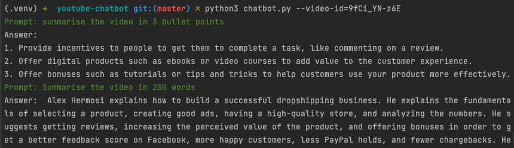

# YouTube Chatbot with LangChain and OpenAI

## Summary
Provided here are a few python scripts to help get started with building your own YouTube chatbot. The scripts use 
LangChain to download the YouTube video transcripts, store them in a vector store, and send requests to the OpenAI
GPT3 LLM so you can ask questions about the video.

A detailed guide to using the scripts is on Medium over here: https://medium.com/@ssmaameri/youtube-chatbot-using-langchain-and-openai-f8faa8f34929 

There are 2 scripts. A very basic one, to get you up and running fast, and a more complex ones, 
that sets up a chat window in the terminal, creating a chatbot style interaction.

`simple-chabot.py` A short script, using the high level LangChain `YoutubeLoader` and `VectorstoreIndexCreator`
wrappers, to start quickly interacting with YouTube videos.

`chatbot.py`  A script using some of the lower level LangChain classes to interact with a YouTube video, which gives you
more options in customising how it works. Creates a chat window in the terminal to allow interacting with the chatbot.

## Getting started

Clone the repository, set up the virtual environment, and install the required packages

```
git clone git@github.com:smaameri/youtube-chatbot.git
cd youtube-chatbot
python3 -m venv .venv
. .venv/bin/activate
pip install -r requirements.txt
```

## Store your OpenAI API key in the .env file
Copy the example env file

`cp .env.example .env`

Now copy your OpenAI API key into the `.env` file, and save the file. It should send up looking something like

`OPENAI_API_KEY=sk-`

## Start chatting

The `video_id` is the part in the YouTube video URL after
the `v=` part.

### simple-chatbot.py
```bash
python3 simple-chatbot.py {video_id}
```

### chatbot.py

Kick of the YouTube chatbot window, and start interacting with the video.  Notice, this one requires a `--video-id` 
flag to be passed in. Enter `q` to exit the prompt at any time.

```bash
python3 chatbot.py --video-id={video_id}
```


